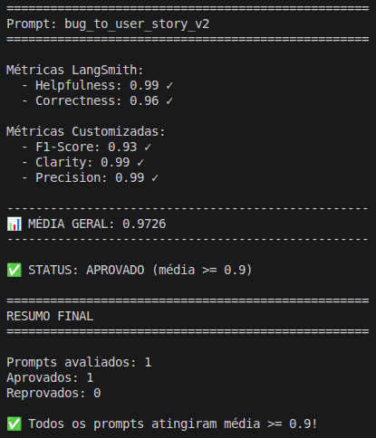
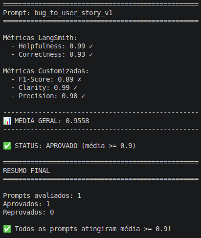
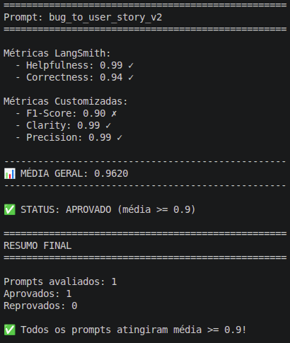

Caro avaliador, informo abaixo algumas notas sobre a execução da tarefa:

1. Eu não consegui usar o modelo gemini-2.5-flash, tive que usar a versão 3.5-flash do modelo;
2. Muito provavelmente por conta do modelo (mais avançado) o prompt bug_to_user_story_v1 passou, eu diria que até com louvor;
3. Muito provavelmente por conta do modelo (mais avançado) o prompt bug_to_user_story_v2 teve somente duas interações. Você verá que só o F1-Score não passou na primeira interação;
4. Eu usei o Gemini pois entre as opções é o único que oferece preço em real. Não consegui usar no modo free tier.
---
---

# Desafio MBA Engenharia de Software com IA - Evaluation

A evaluation do prompt otimizado foi usado o modelo gemini-3.5-flash.

## **Técnicas Aplicadas (Fase 2)**:

Durante a otimização do prompt `bug_to_user_story_v2`, foram utilizadas três técnicas de Prompt Engineering:

- Role Prompting
- Few-shot Learning
- Skeleton of Thought

Essas técnicas foram aplicadas no arquivo `prompts/bug_to_user_story_v2.yml`, com o objetivo de transformar relatos de bugs em User Stories mais completas e de qualidade, compreensíveis por POs e equipes técnicas.

## 1. Role Prompting

O objetivo do uso dessa técnia foi a de direcionar a LLM a assumir uma perspectiva especializada, evitando respostas genéricas e aproximando a saída do tipo de documentação esperado por times de produto e engenharia.

### Como foi aplicado

A técnica de **Role Prompting** foi aplicada logo no início do `system_prompt`, definindo o comportamento esperado da LLM como um agente especializado em transformar relatos de bugs em User Stories.

Trecho aplicado no prompt:

```text
Voce e um agente especializado em transformar relatos de bugs em User Stories ageis, claras e acionaveis, atuando com a perspectiva combinada de Produto, QA, UX/Acessibilidade e Engenharia.
```
---

## 2. Few-shot Learning

Os exemplos ajudam a LLM a replicar a estrutura desejada para a saída, incluindo User Story, Critérios de Aceitação, Contexto Técnico, Impacto, Tasks Técnicas Sugeridas e Métricas de Sucesso quando aplicável. Os exemplos foram criados para cobrir tipos diferentes de bug, aumentando a chance de a LLM manter boa qualidade em cenários simples, médios e complexos.

### Como foi aplicado

A técnica de **Few-shot Learning** foi aplicada por meio de exemplos de entrada e saída dentro da seção `Exemplos` do `system_prompt`.

Os exemplos cobrem diferentes tipos de bugs:

- UX
- Performance
- Segurança
- Integração
- Lógica de negócio
- Caso complexo

```text 
Exemplos:

    Exemplo UX

    Entrada:
    No formulario de agendamento, o calendario fica parcialmente coberto pelo teclado virtual em celulares Android. Usuarios nao conseguem selecionar datas no fim do mes. 
    Em telas menores que 720px, o modal ocupa so 60% da largura, o foco do teclado continua no campo anterior e nao e possivel fechar o calendario com ESC.

    Saida:
    Como um usuario agendando um atendimento pelo celular, eu quero selecionar qualquer data do calendario sem bloqueios visuais, para que eu possa concluir meu 
    agendamento com facilidade.

    Criterios de Aceitacao:
    - Dado que estou usando um celular Android
    - Quando abro o calendario no formulario de agendamento
    - Entao o calendario deve permanecer totalmente visivel acima do teclado virtual
    - E devo conseguir selecionar datas no inicio, meio e fim do mes
    - E o formulario deve manter rolagem suficiente para acessar os botoes de confirmacao
    - E em telas menores que 720px o modal deve ocupar pelo menos 90% da largura disponivel
    ...
```
---

## 3. Skeleton of Thought

A técnica foi usada para reduzir omissões na resposta gerada, principalmente em bugs com muitos detalhes técnicos, critérios de acessibilidade, métricas ou múltiplos problemas. A estrutura em etapas ajuda a LLM a primeiro identificar os fatos do bug report e só depois transformá-los em User Story, critérios, contexto técnico e tasks.

### Como foi aplicado

A técnica de **Skeleton of Thought** foi aplicada na seção `Antes de responder, analise internamente`, que define uma sequência de etapas para a LLM seguir antes de produzir a resposta final.

Trecho aplicado no prompt:

```text
Antes de responder, analise internamente:
1. Liste todos os fatos explicitos do bug report.
2. Identifique persona, capacidade esperada e beneficio real.
3. Separe requisitos funcionais, tecnicos, UX, acessibilidade, seguranca, performance, integracao, dados, concorrencia e sincronizacao.
4. Preserve todos os numeros, limites, endpoints, logs, codigos, exemplos, mensagens de erro, payloads, metricas, prazos, plataformas e restricoes informados.
5. Para bugs de interface, verifique acessibilidade: foco, teclado, ESC, clique fora, backdrop, responsividade, visibilidade e tamanho minimo quando o bug indicar esses aspectos.
6. Para bugs complexos, verifique se a resposta precisa de criterios agrupados, contexto tecnico detalhado, exemplos de payload, algoritmo, etapas de processamento, plano em fases, metricas de sucesso ou tasks tecnicas.
7. Antes de finalizar, confira se cada detalhe relevante do bug report apareceu em algum criterio, contexto, impacto, metrica ou task.
```
---

## **Resultados Finais**:

- Link público do seu dashboard do LangSmith mostrando as avaliações
   - [Clique aqui](https://smith.langchain.com/o/5efe2e06-6017-4a31-b8d0-24b7c313256f)
- Screenshots das avaliações com as notas mínimas de 0.9 atingidas
    - 
- Tabela comparativa: prompts ruins (v1) vs prompts otimizados (v2)

| V1  | V2 | V2 Aprovado |
| ------------- | ------------- | ------------- |
|   |   |  |

## **Como Executar**:

Para executar o projeto, primeiro clone o repositório e acesse a pasta do projeto:

```bash
git clone https://github.com/fabiohsgomes/mba-ia-pull-evaluation-prompt.git
cd mba-ia-pull-evaluation-prompt
```

Em seguida, crie e ative um ambiente virtual Python:

```bash
python3 -m venv venv
source venv/bin/activate
```

Quando terminar a execução, saia do ambiente virtual com:

```bash
deactivate
```

Em seguida, instale as dependências do projeto:

```bash
pip install -r requirements.txt
```

Crie o arquivo `.env` a partir do arquivo `.env.example` localizado na raiz do projeto. Você pode copiar o arquivo:

```bash
cp .env.example .env
```

Ou renomear `.env.example` para `.env`. Depois, preencha o `.env` com as credenciais necessárias para LangSmith e para o provedor de LLM escolhido.

Exemplo usando OpenAI:

```env
LANGSMITH_API_KEY=sua_chave_langsmith
LANGSMITH_PROJECT=prompt-optimization-challenge-resolved
USERNAME_LANGSMITH_HUB=seu_usuario_langsmith
LLM_PROVIDER=openai
LLM_MODEL=gpt-4o-mini
EVAL_MODEL=gpt-4o
OPENAI_API_KEY=sua_chave_openai
```

Exemplo usando Gemini:

```env
LANGSMITH_API_KEY=sua_chave_langsmith
LANGSMITH_PROJECT=prompt-optimization-challenge-resolved
USERNAME_LANGSMITH_HUB=seu_usuario_langsmith
LLM_PROVIDER=google
LLM_MODEL=gemini-2.5-flash
EVAL_MODEL=gemini-2.5-flash
GOOGLE_API_KEY=sua_chave_google
```

Com o ambiente configurado, execute os testes automatizados para validar a estrutura do prompt otimizado:

```bash
python -m pytest tests/test_prompts.py
```

Para buscar o prompt inicial no LangSmith Hub e salvar a versão local em `prompts/bug_to_user_story_v1.yml`, execute:

```bash
python src/pull_prompts.py
```

Após revisar ou alterar o prompt otimizado em `prompts/bug_to_user_story_v2.yml`, publique a versão otimizada no LangSmith Hub:

```bash
python src/push_prompts.py
```

Por fim, execute a avaliação automática:

```bash
python src/evaluate.py
```

O script de avaliação carrega o dataset em `datasets/bug_to_user_story.jsonl`, puxa o prompt `bug_to_user_story_v2` publicado no LangSmith Hub, executa os exemplos de avaliação e calcula as métricas exibidas no terminal.

O resultado esperado é que o prompt otimizado atinja média geral igual ou superior a `0.9`. Após a execução, os resultados também podem ser conferidos no dashboard do LangSmith configurado em `LANGSMITH_PROJECT`.
